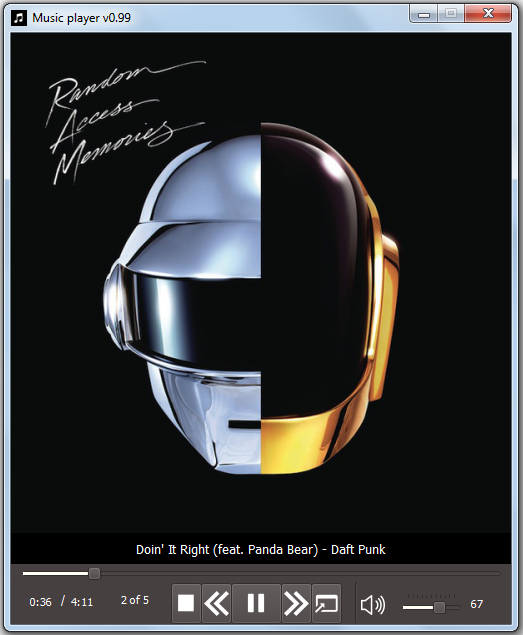

# Simple mp3-player
 
Task: combining pygame and PyQt5 in Python3. 
Gui powered by PyQt5. 
Music playback is carried out using the pygame.mixer.music. 
 # Features:
 - showing the music album cover
 - showing the artist and the song title
 - rewind a track by clicking on the progress bar
 - simple playlist
 - switching between tracks
 - adding a track via a dialog box or Drag and Drop
 # Requirements
 For running application:
 * OS: Windows 7, 8, 10 x86/x64 
 * [Python 3.8.6](https://www.python.org/ftp/python/3.8.6/python-3.8.6-amd64-webinstall.exe)
 * [PyQt5](https://pypi.org/project/PyQt5/)
 * [pygame](https://pypi.org/project/pygame/)
 * [mutagen](https://pypi.org/project/mutagen/)
 # How to use:
 launch main.py
 # Future updates:
 * improving the work with encodings
 * improve the status bar
